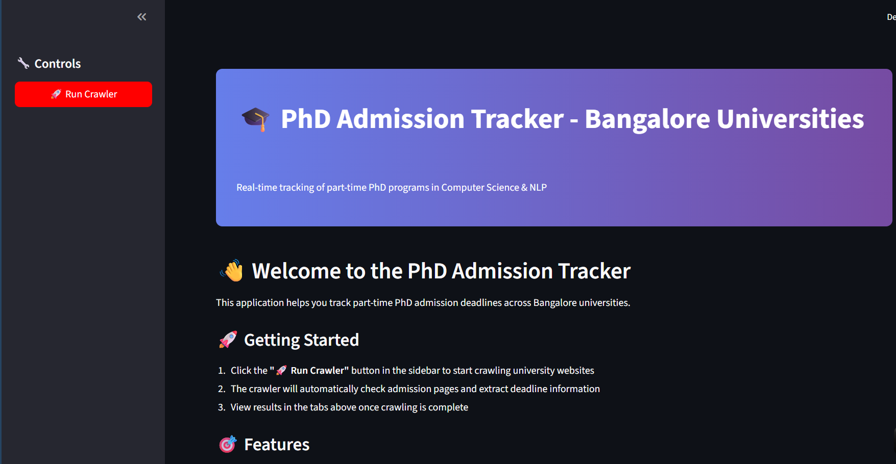
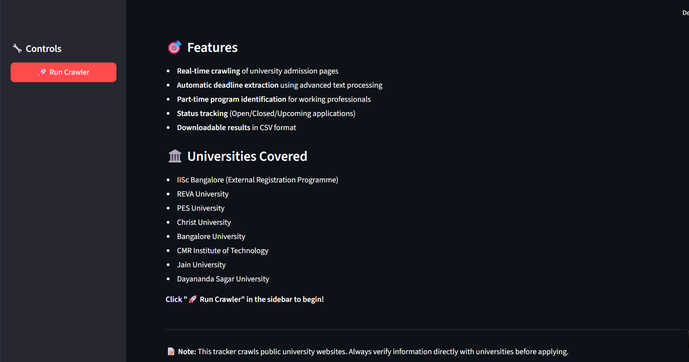
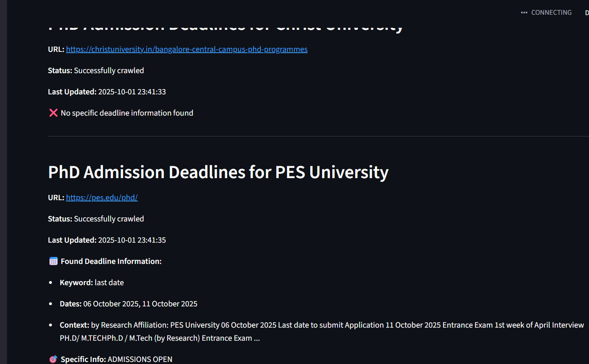

# PhDTracker
A python project to seek the last date of Phd Form submission in selected colleges of Bangalore
It uses regex to seek the last date. 

The project is deployed in streamlit community cloud


## Usage
1. Clone the repository
2. Install the required packages
3. Run the script

## Required Packages
- requests
- bs4
- pandas
- streamlit

## How to run
1. Clone the repository
2. Install the required packages
3. Run the script 
```streamlit run webui.py```

## Significance
1. LLM are costly, these domain specific task can also be perform with regex.
2. Although the results are not good as Agentic RAG with search tools, it can be improved with further refining the regex pattern
and pdf parsher.

## Results

# HomePage



# Search Results


## Contributing
If you want to contribute to this project, please fork the repository and create a pull request.

## License
This project is licensed under the MIT License.
